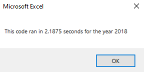
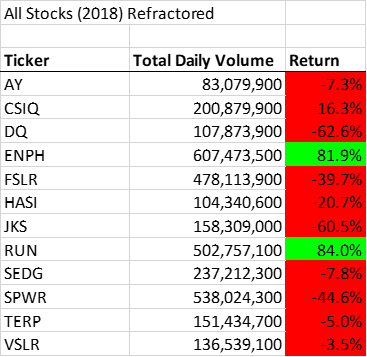
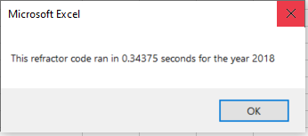

# Stock-Analysis

## Overview
The purpose of this project was to take the code written in the module and refactor it to allow for more efficient use. The data provided was for differnt tickers over the time, showing the volume traded and price data for a given day. Using the code, we were attempting to anlayze each ticker over the course of a year, looking at the performance as well as the starting/ending prices. 

## Results: Using images and examples of your code, compare the stock performance between 2018 and 2018, as well as the execution times of the original script and the refactored script.

While the code written in the module was sufficient for the exercise, it would not have been efficient if the data size had increased. In order to look at the difference between the two run times, it is important to deciher how each code was run. To be able to differentiate the two codes, the module code will be referred to "2018 Code" an the refactored code will be referred to as "2018 Refactored Code."

### 2018 Code 
The 2018 Code used a nested for loop to loop through both the tickers, and then each row to determine the values for Total Volume, Starting Price and Endinging Price. 

The initial for loop shown below shows that we want to loop through the all 12 tickers, starting 0 as all Tickers for *i* had previously been initialized for the tickers array. In addition, we set the *TotalVolume* to zero each time *i* looped through. 

        For i = 0 To 11

        ticker = Tickers(i)
    
        TotalVolume = 0

We then nested another for loop within to loop through the rows where *j* is the row number. For each ticker, the goal was to loop through the rows and determine if that row belonged to that ticker based on value *i*. If the *ticker* was the same then, the total volume would be added to the *TotalVolume* variable. For the prices, it determined it based on the previous and next rows in addition to the current rows to set prices.         

            For j = 2 To rowend
    
                If Cells(j, 1).Value = ticker Then
            
                    TotalVolume = TotalVolume + Cells(j, 8).Value
                
                End If
                
                If Cells(j - 1, 1).Value <> ticker And Cells(j, 1).Value = ticker Then
                
                    StartingPrice = Cells(j, 6).Value
                      
                End If
                
                If Cells(j + 1, 1).Value <> ticker And Cells(j, 1).Value = ticker Then
                
                    EndingPrice = Cells(j, 6).Value
            
            End If
       
            Next j

Finally all values are entered into the spreadsheet before looping to the next ticker. 

        Worksheets("All Stocks Analysis").Activate
    
         Cells(4 + i, 1).Value = ticker
         Cells(4 + i, 2).Value = TotalVolume
         Cells(4 + i, 3).Value = (EndingPrice / StartingPrice) - 1

        Next i

When running this method and setting the values once the loops were complete, we were able to achieve the results to show the below. Total time to run the 2018 Code was 2.1875 seconds. 

                           

<kbd><kbd>

### 2018 Refactored Code

Unlike the 2018 Code, the 2018 Refactored Code uses multiple arrays to increase the efficiency of the code. The Ticker Volumes, Starting and Ending Prices were previous set as indivual variables. In this new script, we have set them to also be arrays similar to tickers. We also introduced a new variable called *TickerIndex* to be used later on as the index of the arrays. 
      
      Dim TickerIndex As Single
    
      TickerIndex = 0
        
      Dim TickerVolumes(12) As Long
      Dim TickerStartingPrices(12) As Single
      Dim TickerEndingPrices(12) As Single
      
Similar to 2018 Codew, a For loop was written to loop through the tickers array, only this time the *Tickervolumes* for all indexes *i* are set to 0. 

      For i = 0 To 11

          TickerVolumes(i) = 0

      Next i

The major differece between the two codes is how we choose to store the data and cycle through the rows. The use of the arrays, allows for the data to be stored within the array rather than only having one value set for the variable. With the addition of the *TickerIndex* variable, we no longer needed to use a nested for loop to cycle through the rows. After intializing the *Tickerindex* to zero, we inititally loop through the rows for *TickerIndex* at zero but then add 1 after we find the *TickerEndingPrices* value. At that point, it continues on where it left off in the row count but is now on the next value. 
        
        For i = 2 To RowCount
    
           TickerVolumes(TickerIndex) = TickerVolumes(TickerIndex) + Cells(i, 8).Value
                   
                If Cells(i - 1, 1).Value <> Tickers(TickerIndex) Then
        
                        TickerStartingPrices(TickerIndex) = Cells(i, 6).Value
                
                End If
        
                 If Cells(i + 1, 1).Value <> Tickers(TickerIndex) Then
        
                        TickerEndingPrices(TickerIndex) = Cells(i, 6).Value
        
                         TickerIndex = TickerIndex + 1
                 
                End If 

Because the data is stored within the array, we no longer need to enter the data as part of the For loop. Instead the data is stored witin the array and then put in the appropriate cells after. 

        For i = 0 To 11
        
                Worksheets("All Stocks Analysis").Activate
        
                Cells(4 + i, 1).Value = Tickers(i)
                Cells(4 + i, 2).Value = TickerVolumes(i)
                Cells(4 + i, 3).Value = (TickerEndingPrices(i) / TickerStartingPrices(i)) - 1

        Next i
    
When running this method and setting the values once the loops were complete, we were able to achieve the results to show the below. Total time to run the 2018 Refactored Code was 0.34375 seconds.      
        
       
<kbd><kbd>  
        
### Overall Results 
        
Overall, the refactored code took about six times less time to run than the original. By using a group of arrays to store the data and adding an additional variable to link the arrays, we reduce the need for the nested for loop. By shorting the amount of times the for loop needed to run in the 2018 Refractor Code, the total amount of time was also reduced.  
        
## Summary: In a summary statement, address the following questions.

        -What are the advantages or disadvantages of refactoring code?

        
        -How do these pros and cons apply to refactoring the original VBA script?

